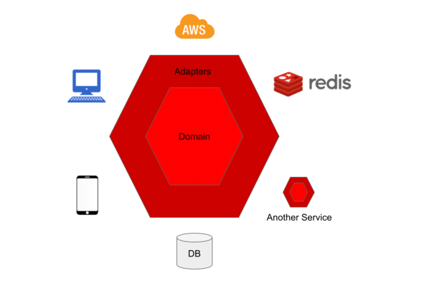

### Hexagonal, Multi module

### 헥사고날 아키텍처란?
- 사전적 의미로 육각형 건축물이라고 한다.
- 레이어 간의 원하지 않는 종속성이나 비즈니스 로직으로 인한 사용자 인터페이스 코드의 오염과 같은 객체 지향 소프트웨어 설계의 알려진 구조적 함정을 피하기 위해 Alistair Cockburn에 의해 발명되었다.
- 포트 및 어댑터 아키텍처라고도 불림

### 헥사고날 아키텍처의 장점?
1. 아키텍처 확장에 용이하다.
2. SOLID를 쉽게 적용가능
3. 모듈 일부를 배포하는데 용이하다.
4. 테스트를 위해 모듈을 가짜로 바꿀 수 있으므로 테스트가 더 안정적이고 쉽습니다.
5. 더 큰 비즈니스적 가치를 갖고 더 오래 지속되는 도메인 모델에 큰 관심을 둡니다.